# Whetstone

**A reading and writing tool that argues with you.**

You paste in a document. Whetstone helps you read it and build an argument from
it , but never produces your conclusions. It gives you **lenses** (where to look,
and why), **provocations** (objections you have to answer), and a running count
of how much of the finished work is actually yours.

There is no chat box. That is the point.

*[The full walkthrough is below.](#the-demo)*
---

## Quick start

```sh
git clone https://github.com/tanisha327/whetstone.git
cd whetstone
go mod tidy               # writes go.sum on first checkout
go build -o whetstone ./cmd/whetstone

./whetstone -set-key      # paste your OpenAI key once (input is hidden)
./whetstone -check        # confirm the key, endpoint and model work
./whetstone -web          # opens the browser UI
```

Go 1.25.13+ and an OpenAI-compatible API key. Nothing else, no npm, no bundler,
one binary.

---

## The demo

Each figure is annotated: **amber** is what the tool does and
refuses to do, **green** is what came from you.

**1. Three columns, and nowhere to chat.** Sources you paste, the passage you are
reading, the argument you are building.

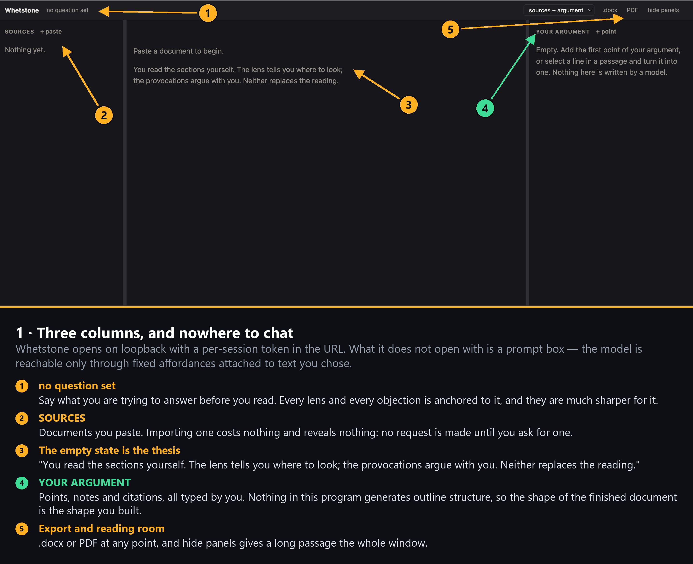

**2. Your question, not a prompt.** The only free text that reaches the model. It is pasted into fixed prompts as the thing you are
trying to answer.

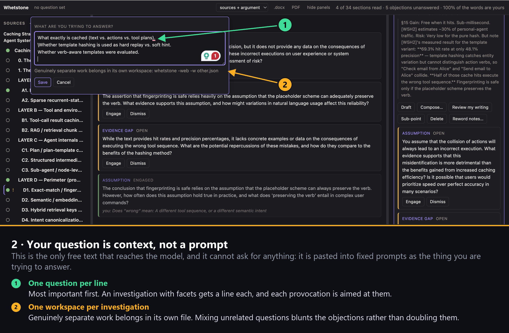

**3. Paste a document. Nothing is sent.** Splitting and cleaning happen locally.
No request, no tokens.

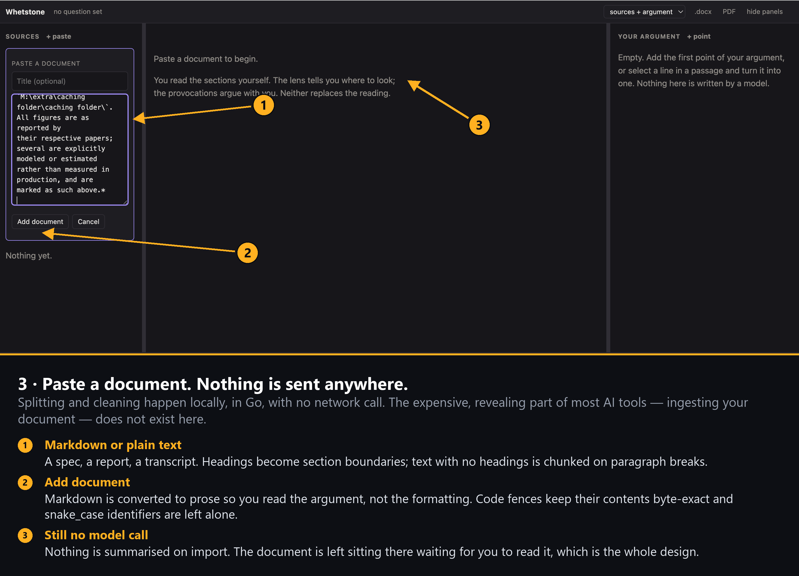

**4. 34 sections, all unread.** Not a summary, a list of units of attention.

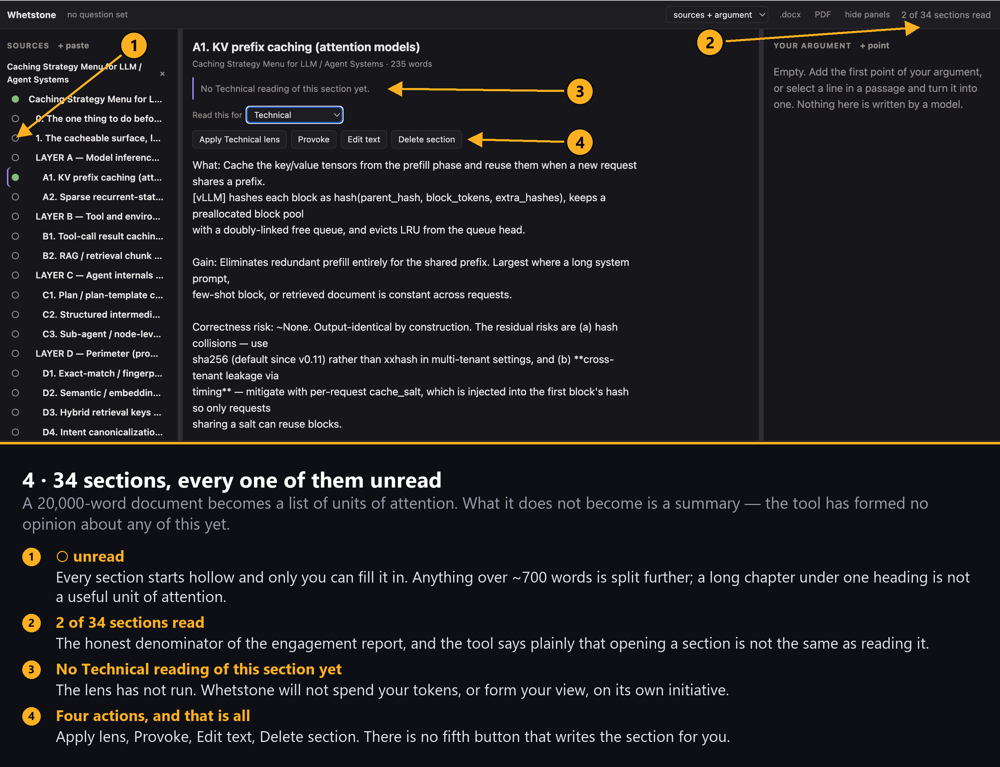

**5. A lens, not a summary.** A summary answers *"what does this say?"* and
replaces the reading. A lens answers *"what bears on my question?"* and directs
it. The passage stays on screen underneath.

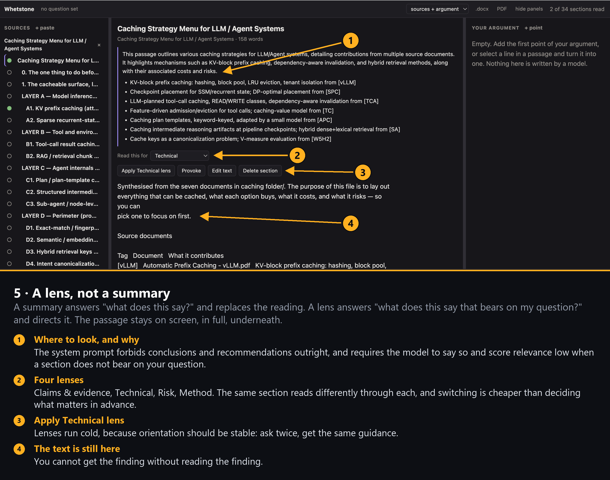

**6. It argues with you.** Five kinds of objection: counterargument, unstated
assumption, evidence gap, alternative reading, named fallacy. Each ends in a
question. Each stays `OPEN`.

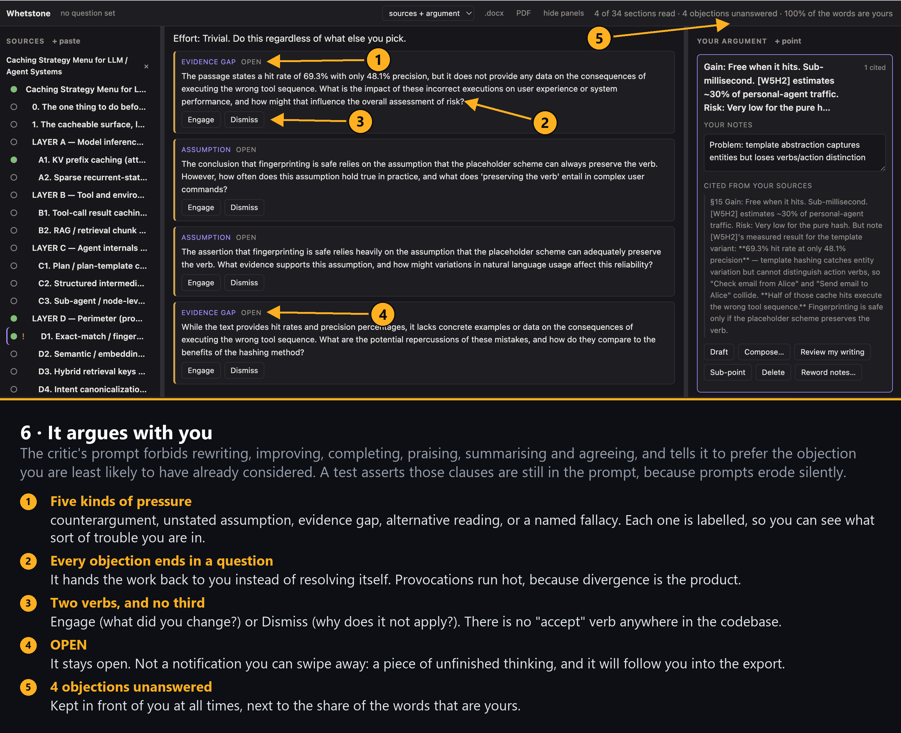

**7. Select a line, make it your point.** The citation is a by-product of making
the claim.

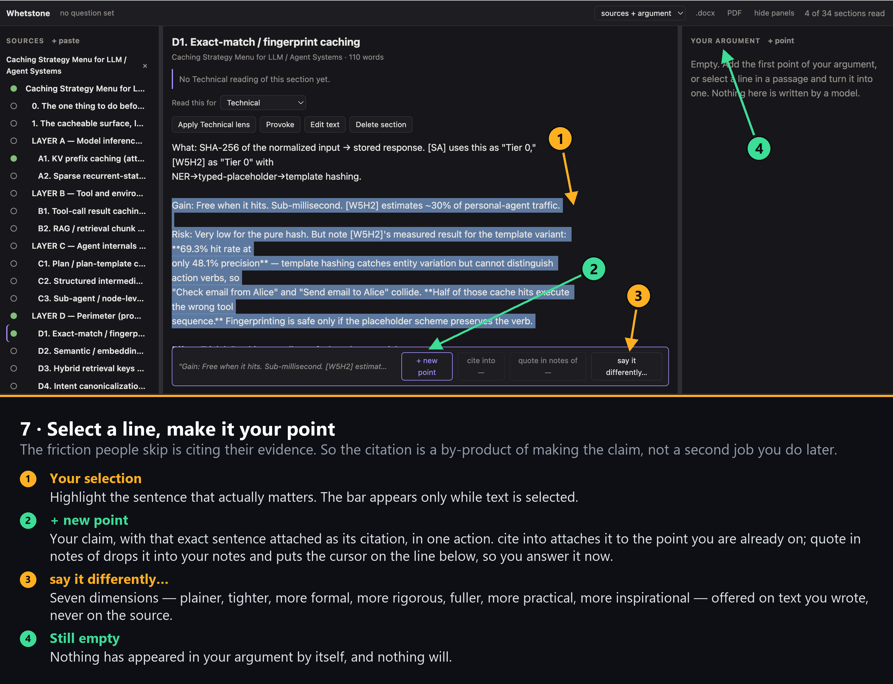

**8. The argument is structurally yours.** Draft builds prose *from* your notes
and citations, and refuses to run without them.

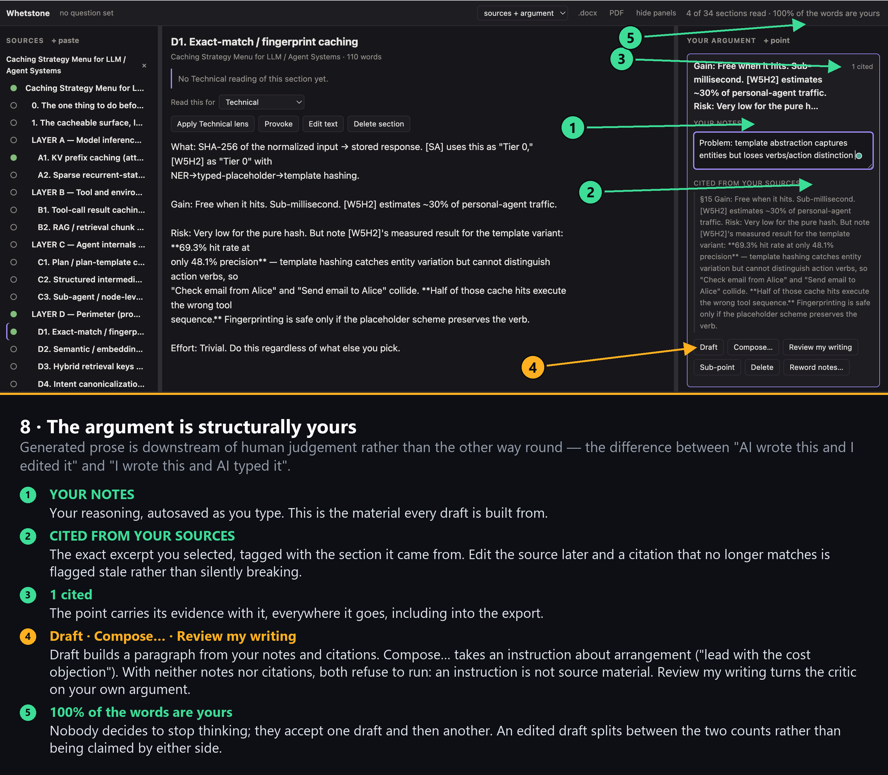

**9. Resolving an objection costs a sentence.** `Dismiss("")` returns an error.
There is a test for it.

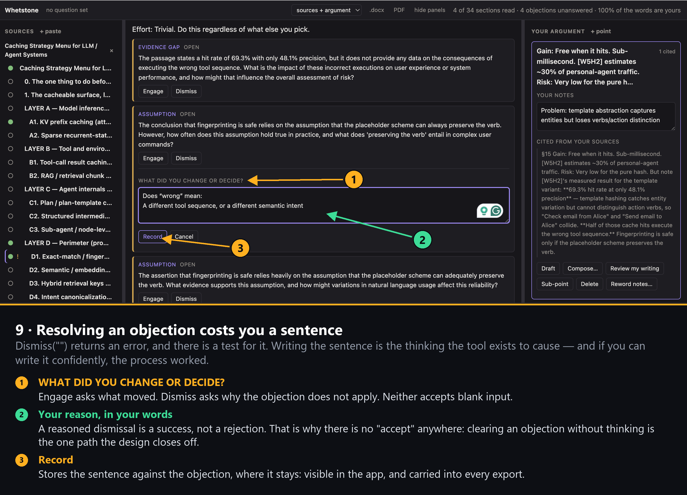

**10. Resolved, not deleted.** Your reason stays on the record, and the header
count drops by exactly one.

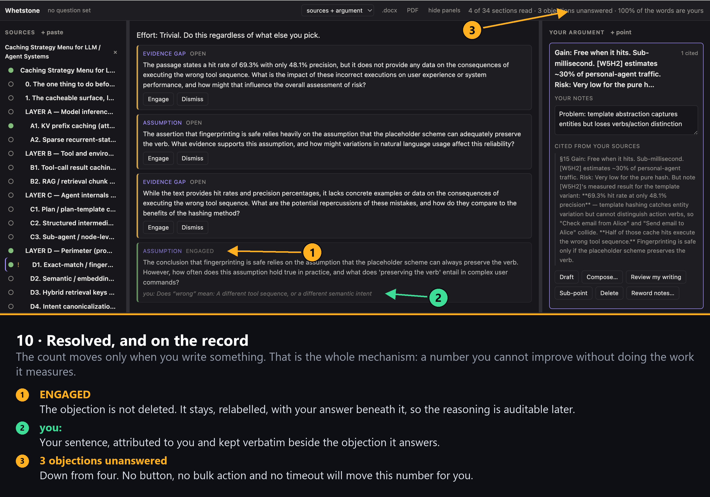

**11. Then it argues about your argument.** The critic can object to your
inference. It cannot restructure your outline or rewrite your prose, those paths
do not exist.

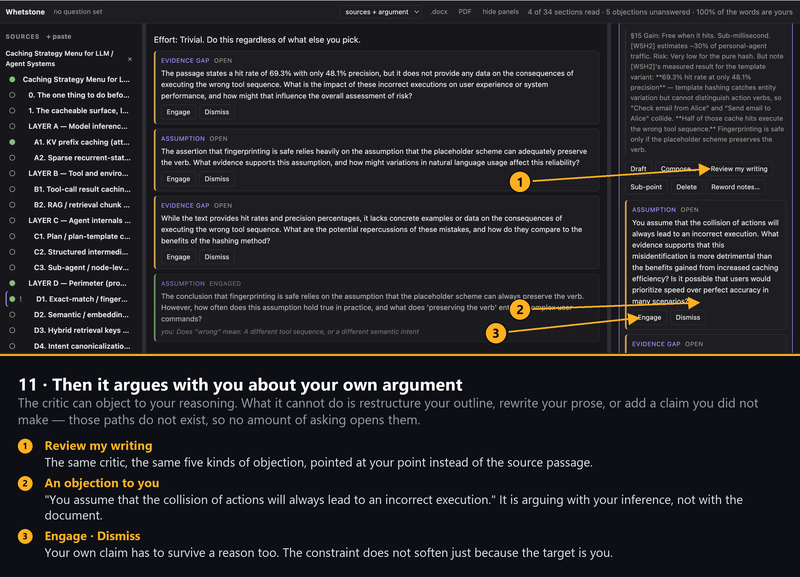

---

## What the model can and cannot do

Six fixed affordances, each attached to material you selected, each with its own
prompt and response schema. 

| Affordance | Input | Cannot |
|---|---|---|
| **Lens** | one section | draw conclusions or recommend |
| **Provoke** | one passage | rewrite, praise, summarise, agree |
| **Review my writing** | one point of *your* argument | restructure your outline |
| **Draft** | one point's notes and citations | add claims not in them |
| **Compose…** | the same, plus an instruction about arrangement | run with no notes and no citations |
| **Say it differently** | your own prose, plus a dimension | touch the source document |


## Six refusals, all enforced by tests

| | |
|---|---|
| **It will not read for you** | The lens points; the passage stays. The prompt forbids conclusions and requires the model to score relevance low when a section does not bear on your question. |
| **It argues instead of agreeing** | The critic is forbidden from praising, improving or agreeing, and told to prefer the objection you are least likely to have considered. A test asserts those clauses are still in the prompt. |
| **Dismissing costs a sentence** | `Dismiss("")` is an error. A reasoned dismissal is a success, which is why there is no "accept" verb in the codebase. |
| **The argument is yours** | Nothing generates outline structure. Generated prose is downstream of your judgement, not the reverse. |
| **There is no delegation path** | A chat box makes the cost of asking always lower than the cost of doing. See [ADR 0001](docs/adr/0001-no-chat-box.md). |
| **The drift stays visible** | The header shows sections opened, objections unanswered, and the share of words that are yours. Edited drafts split between the two counts. |

The engagement report states its own limits: *"Counts opened sections and typed
words. It cannot tell whether you read carefully or thought hard."* 

---

## Two front ends, one workspace

```sh
./whetstone -web     # browser: read, write, draft, export
./whetstone          # terminal: read, apply lenses, provoke, resolve
```

Both read and write the same JSON file, atomically. Quit one, open the other,
your work continues. **Use `-web` for real work**, writing a paragraph in a
terminal is a bad time, and the terminal help screen says so.

In the browser: drag the dividers to resize (widths persist, double-click
resets), and `hide panels` gives a long passage the whole window. Everything you
type happens in place; there are no popup dialogs.

Terminal keys: `j`/`k` move · `enter` read · `a` apply lens · `L` switch lens ·
`p` provoke · `n` next provocation · `y` engage · `x` dismiss · `s` save · `q`
quit · `?` help.

## Exporting

`.docx` is written directly; `PDF` opens the browser print dialog. The scope
dropdown changes nothing on screen, it applies when you press a button.

| Scope | Contains |
|---|---|
| `sources + argument` (default) | every section in full, plus your points, prose and citations |
| `argument only` | just what you wrote |
| `sources only` | just the documents, including your edits |

Every export also carries the objections you have **not** answered, and your
engagement figures. The unfinished thinking travels with the document.

---

## Reference

| Command | Does |
|---|---|
| `whetstone -web` | Browser UI |
| `whetstone` | Terminal UI |
| `whetstone -set-key` | Prompt for a key (hidden), store it at mode 0600, exit |
| `whetstone -check` | Verify key, endpoint and model with one request, exit |
| `whetstone -delete-key` · `-version` | Remove the stored key · print version |

| Flag | Meaning |
|---|---|
| `-w <file>` | Workspace file. Default `whetstone.json` here. |
| `-question <text>` | The question you are answering |
| `-port <n>` · `-no-open` | Port for `-web` (default: any free) · print the URL instead of opening a browser |
| `-key-file <path>` | Read the key from this file, this run only |

Documents can be loaded from the command line: `./whetstone -web notes.md spec.md`

| Variable | Meaning |
|---|---|
| `OPENAI_API_KEY` | API credential |
| `WHETSTONE_BASE_URL` | OpenAI-compatible endpoint. Default `https://api.openai.com/v1`. |
| `WHETSTONE_MODEL` | Model name. Default `gpt-4o-mini`. |
| `WHETSTONE_KEY_FILE` | Override the key file location |

Any OpenAI-compatible endpoint works with no code change:

```sh
export WHETSTONE_BASE_URL=https://your-gateway.example/v1
export WHETSTONE_MODEL=gpt-4o
./whetstone -check          # prints endpoint, model, latency, tokens, reply "OK"
```

The key is resolved from `-key-file`, then `$OPENAI_API_KEY`, then the stored
file, first hit wins. There is deliberately **no project-local source**: a
credential beside the source tree eventually gets committed. It is read once at
startup, never written to disk by a running session, and scrubbed from every
error message.

---

## Why it works this way

This implements the design principles in Advait Sarkar's TED talk,
[*How to Stop AI from Killing Your Critical Thinking*](https://www.youtube.com/watch?v=3lPnN8omdPA).

The problem it names: when AI intermediates every step, we get fewer ideas, think
about them less critically, and remember them less well, not because the output
is bad, but because the friction we outsourced is where the thinking lived. You
become *a professional validator of a robot's opinions*.

> Efficiency is not the aim of Tools for Thought. Better thinking is.
> But sometimes you can have both.

---

## Layout and development

```
cmd/whetstone/        entrypoint: flags, credential commands, front-end choice
internal/
  provider/           the LLM seam: interface, credentials, OpenAI client
  doc/                loading, section splitting, markdown-to-prose
  lens/  provoke/     task-relevant reading; objections
  rewrite/  outline/  alternative phrasings; your argument tree
  export/  workspace/ .docx and text output; atomic persistence, engagement
  web/  tui/          net/http + go:embed; bubbletea
docs/adr/             architecture decision records
images/               README figures (raw/ holds the captures)
scripts/              test runner and figure annotator
```

Three dependencies: `bubbletea` and `lipgloss` for the terminal UI,
`golang.org/x/term` for hidden key input. The web UI is stdlib only.

`internal/provider` is the only package that knows a vendor exists; everything
above it depends on a two-method interface. That is why the whole suite runs with
**no key and no network**, consumers use small fakes in their own `_test.go`
files. There is no mock provider and no offline mode
([ADR 0002](docs/adr/0002-provider-seam.md)).

```sh
go test -race ./...                        # what CI runs
gofmt -l . && go vet ./...
node --check internal/web/assets/app.js    # after any client change
```

A lens is data: add an entry to `lens.Builtin`, where `Focus` is the only field
the model sees. Rewrite dimensions (`rewrite.Builtin`) work the same way. For the
constraints a change must not break, and how to add a model call, see
[CONTRIBUTING.md](CONTRIBUTING.md).


---

## License

MIT, see [LICENSE](LICENSE). Use, modify, distribute and sell freely, including
in commercial and closed-source work; the copyright notice travels with it. No
warranty.

Copyright © 2026 tanisha327.
